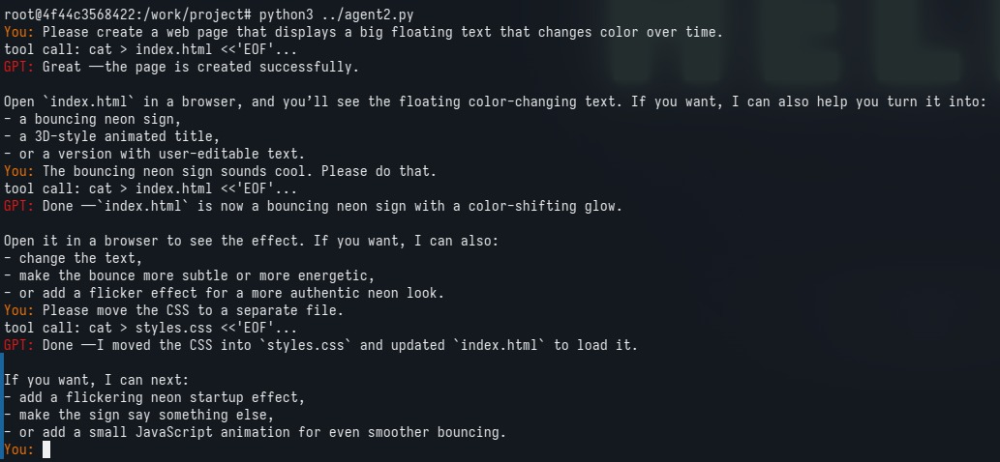

# tinyagent
Tiny coding agent loop in around 70 lines of Python, implemented without using the API's built-in tool calling facilities.
Mostly to to demonstrate to myself how LLM tool calling works under the hood.
The only tool available is running shell commands, but that's enough to work.

If you want to run this (and I don't know why you'd want to do that), please do so in a Docker container. The script will just execute any command.

The first two sentences of the system prompt are borrowed from [Pi](https://pi.dev/).

## Demo

The output files can be found under [demo](./demo).

## Update

[with_tools.py](./with_tools.py) contains a version that uses OpenAI's newer Responses API and uses their actual tool-calling scheme, and is running gpt-5.6-luna.
